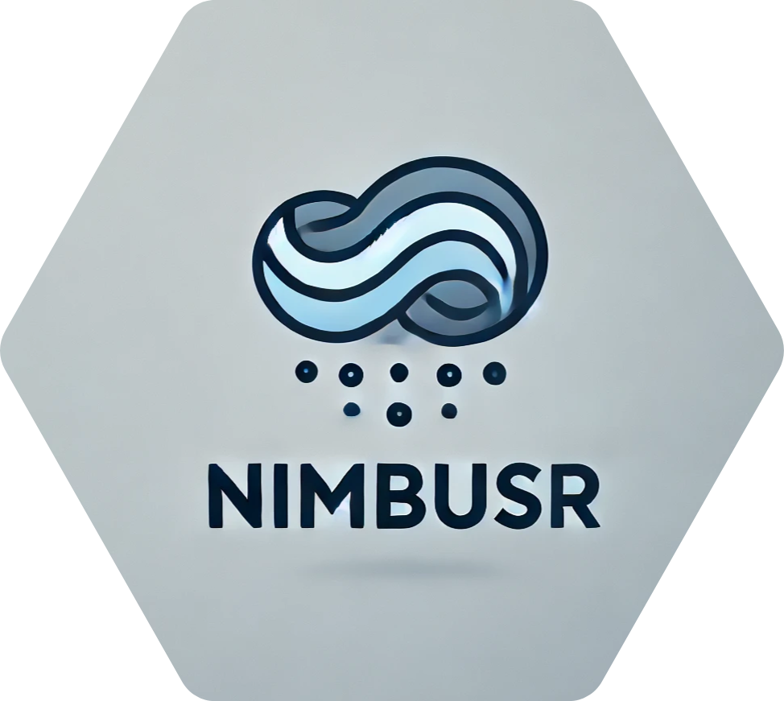

<!-- README.md is generated from README.Rmd. Please edit that file -->

```{r, include = FALSE}
knitr::opts_chunk$set(
  collapse = TRUE,
  comment = "#>",
  fig.path = "man/figures/README-",
  out.width = "100%"
)
```

# NimbusR

NimbusR 

<!-- badges: start -->

[](https://github.com/JuanMLeoni/NimbusR/actions/workflows/R-CMD-check.yaml) [](https://app.codecov.io/gh/JuanMLeoni/NimbusR) [](https://lifecycle.r-lib.org/articles/stages.html#experimental)


<!-- badges: end -->

NimbusR es un paquete de R diseñado para el análisis y visualización de datos relacionados con las condiciones meteorológicas y la temperatura. Con un enfoque en la facilidad de uso y la eficiencia, NimbusR permite a los usuarios generar gráficos informativos y realizar análisis estadísticos con conjuntos de datos meteorológicos.

**Funcionalidades**:

-   **Visualización de Temperaturas**: Genera gráficos de series de tiempo que muestran las temperaturas en diferentes estaciones, facilitando la comparación entre distintas ubicaciones y periodos.

-   **Resumen Estadístico**: Calcula estadísticas descriptivas, como la temperatura media, máxima, mínima y desviación estándar, a partir de los datos de temperatura de múltiples estaciones.

-   **Validaciones**: Incluye validaciones robustas para asegurar que los conjuntos de datos cumplen con los requisitos necesarios antes de realizar análisis, mejorando la confiabilidad de los resultados.

-   **Facilidad de uso**: Diseñado para que incluso los usuarios menos experimentados puedan comenzar a trabajar con datos meteorológicos rápidamente.

-   **Interoperabilidad**: Funciona bien con otras librerías populares de R, como `dplyr` y `ggplot2`, facilitando la integración en flujos de trabajo existentes.

-   **Documentación completa**: Cada función incluye documentación detallada, ejemplos y descripciones para ayudar a los usuarios a comprender su funcionamiento.

## Instalación

Podes instalar la versión en desarrollo de Nimbus en [GitHub](https://github.com/JuanMLeoni/NimbusR):

``` r
# install.packages("pak")
pak::pak("JuanMLeoni/NimbusR")

devtools::install_github("JuanMLeoni/NimbusR")
```

## Funcionalidades

Para verificar que NimbusR se descargó de forma correcta probar con:

```{r example}
library(NimbusR)
TempCtoF(15)
```

**Para ver todas las funciones y dataset del paquete, entrar a la página de [NimbusR](https://juanmleoni.github.io/NimbusR/)**

## Reporte de Bugs y Errores {#reporte-de-bugs-y-errores}

En NimbusR, nos esforzamos por ofrecer un paquete libre de errores y fácil de usar. Sin embargo, si encuentras un bug o un error, queremos asegurarnos de que pueda ser resuelto rápidamente. A continuación, se indican los pasos a seguir para reportar problemas de manera efectiva:

### Cómo reportar un Bug

1.  **Verifica si el problema ya fue reportado:**

    Antes de crear un nuevo reporte, revisa los [Issues](https://github.com/JuanMLeoni/NimbusR/issues) en nuestro repositorio de GitHub para ver si el bug ya ha sido reportado. Si es así, puedes comentar en ese issue para agregar más detalles.

2.  **Crea un nuevo Issue:**

    Si no encuentras el problema que experimentaste, crea un nuevo issue en el repositorio. Para ello, proporciona la siguiente información:

    -   **Descripción del bug**: Una breve descripción del problema que estás experimentando.

    -   **Pasos para reproducir**: Instrucciones claras y detalladas sobre cómo reproducir el error. Incluye código de ejemplo si es posible

    -   **Resultados esperados**: Describe lo que esperabas que sucediera.

    -   **Resultados obtenidos:** Explica lo que realmente ocurrió, incluyendo mensajes de error si los hubo.

    -   **Entorno de trabajo:** Proporciona detalles sobre tu entorno, como la versión de R, la versión de NimbusR, y cualquier otra librería relevante que estés utilizando.

Nos comprometemos a responder a los reportes de bugs en un plazo razonable. Una vez que recibamos tu reporte, haremos todo lo posible para replicar el problema y trabajar en una solución. Puedes seguir el progreso de tu reporte en la sección de issues de nuestro repositorio.

Agradecemos tu colaboración para mejorar NimbusR. Cada reporte de bug nos ayuda a hacer que el paquete sea más robusto y útil para todos los usuarios. ¡Gracias por tu apoyo!

## Guía de Contribuciones

¡Contribuciones son bienvenidas! Si deseas ayudar a mejorar NimbusR, aquí te explicamos cómo puedes hacerlo. Cada tipo de contribución, grande o pequeña, es apreciada y ayuda a que nuestra comunidad crezca.

### Cómo contribuir

1.  **Reporta un Problema:**

    Si encuentras un bug o un error, por favor, repórtalo siguiendo las instrucciones en la sección [Reporte de Bugs y Errores](#reporte-de-bugs-y-errores). La información detallada que proporcionas nos ayuda a mejorar el paquete.

2.  **Mejora la Documentación:**

    La documentación clara y precisa es fundamental. Si encuentras áreas que pueden mejorarse, no dudes en sugerir cambios o incluso enviar un pull request con tus mejoras.

3.  **Sugerencias de Nuevas Funciones:**

    Si tienes ideas para nuevas funciones o mejoras, crea un nuevo issue en el repositorio. Proporciona detalles sobre tu sugerencia y por qué crees que sería útil para otros usuarios.

4.  **Contribuir Código**: Si deseas contribuir con código, aquí hay un proceso sugerido:

    -   **Haz un Fork del Repositorio**: Crea una copia del repositorio en tu propia cuenta de GitHub.
    -   **Crea una Nueva Rama**: Antes de realizar cambios, crea una nueva rama en tu fork para trabajar. Nombra la rama de manera descriptiva, por ejemplo, `mejora-documentacion` o `nueva-funcion`.
    -   **Realiza tus Cambios**: Haz las modificaciones necesarias en tu rama. Asegúrate de seguir las mejores prácticas de codificación y de que el código esté bien documentado.
    -   **Pruebas**: Si has agregado nuevas funcionalidades, asegúrate de incluir pruebas para verificar que todo funcione como se espera.
    -   **Crea un Pull Request**: Una vez que estés satisfecho con tus cambios, envía un pull request a la rama principal del repositorio. Describe claramente los cambios realizados y por qué son beneficiosos.

5.  **Revisiones de Código**: Estamos comprometidos con la calidad del código. Si contribuyes, tu pull request será revisado por uno de los mantenedores del paquete. Puedes recibir comentarios y sugerencias para mejorar tu contribución.

### Estilo de Código

Asegúrate de seguir las pautas de estilo de código de R y de que tu código esté bien comentado. Esto facilitará la revisión y la comprensión por parte de otros colaboradores.

### Agradecimientos

Agradecemos a todos los que dedican tiempo y esfuerzo a contribuir a NimbusR. Cada contribución ayuda a construir un paquete más robusto y valioso para la comunidad. ¡Gracias por tu apoyo!

## Código de Conducta

Para asegurar un ambiente inclusivo y respetuoso en nuestra comunidad, hemos establecido un Código de Conducta. Te invitamos a revisar el archivo [CODE_OF_CONDUCT.md](CODE_OF_CONDUCT.md) para conocer las expectativas y normas que guían nuestra interacción.

Es fundamental que todos los colaboradores y usuarios se adhieran a este código para fomentar un espacio seguro y acogedor. Agradecemos tu compromiso con estos principios.
